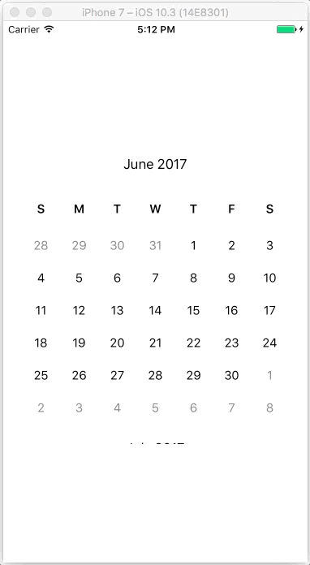

# DTCalendarView

DTCalendarView is a library to present a vertical scrolling calendar. It supports single value and range selection and dragging of selected dates. The font and color of most items can be styled.



## Example

To run the example project, clone the repo, and run `pod install` from the Example directory first.

## Requirements

## Installation

DTCalendarView is available through the Dynamit [CocoaPods](http://cocoapods.org). To install
it, simply add the following line to your Podfile:

```ruby
source 'ssh://git@stash.dynamit.com/mob/dynamit-pod-specs.git'
source 'https://github.com/CocoaPods/Specs.git'

pod "DTCalendarView"
```

## Author

tim@dynamit.com

## License

DTCalendarView is available under the MIT license. See the LICENSE file for more info.
